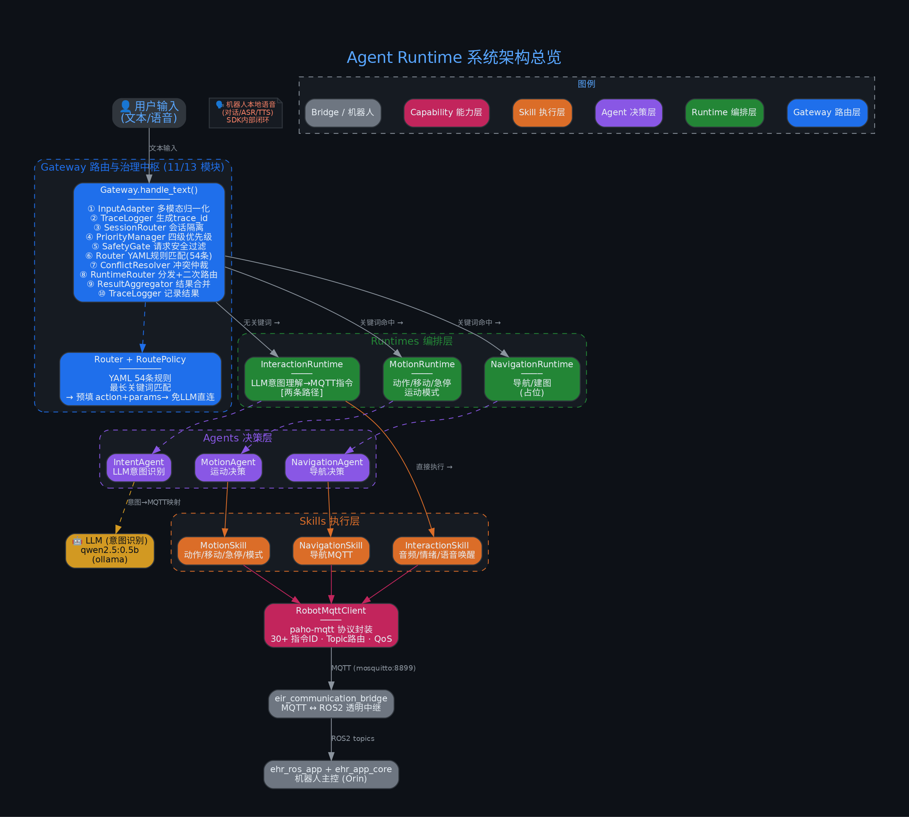
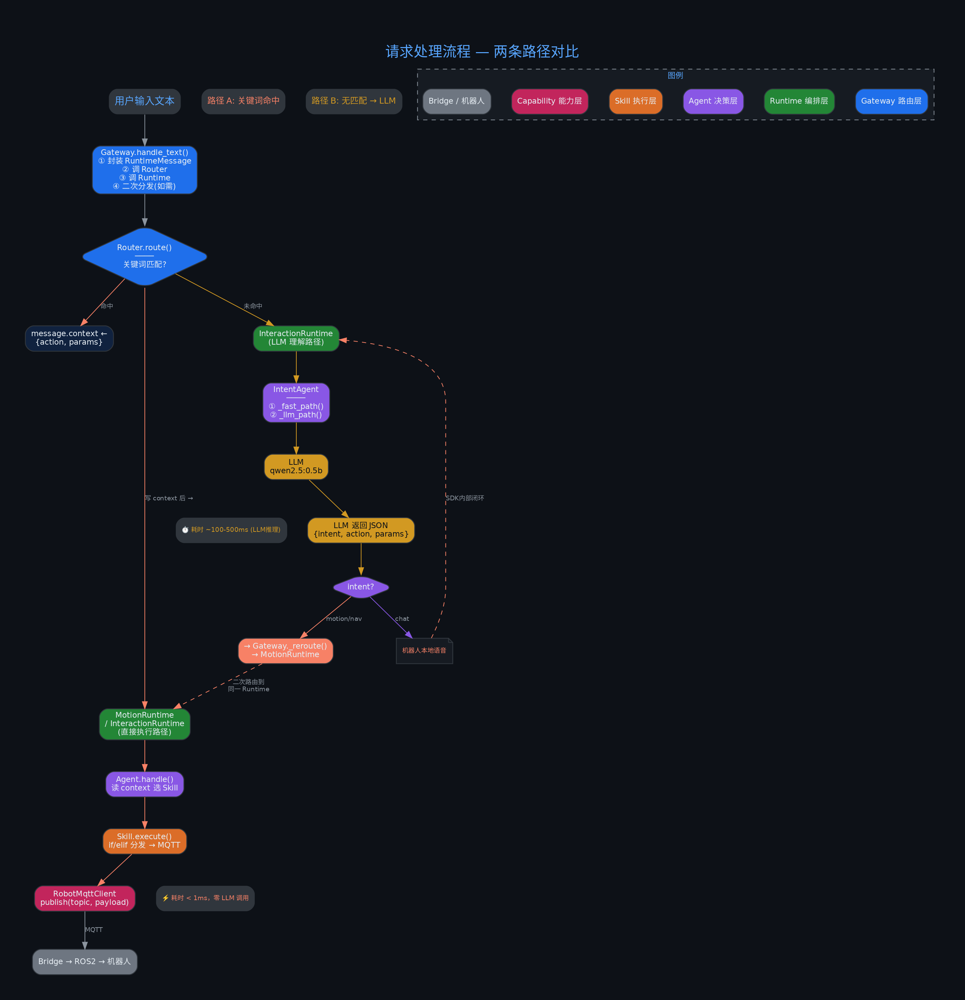
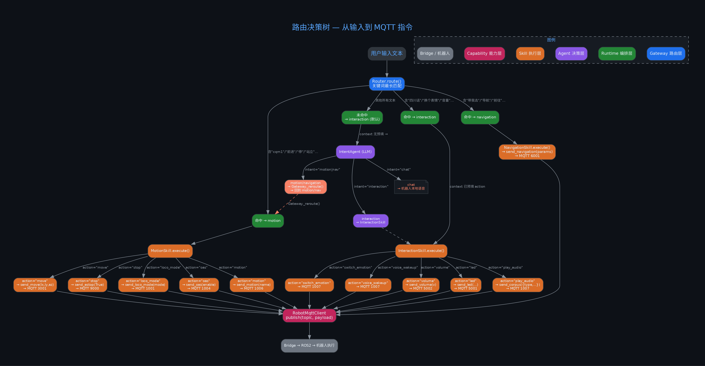
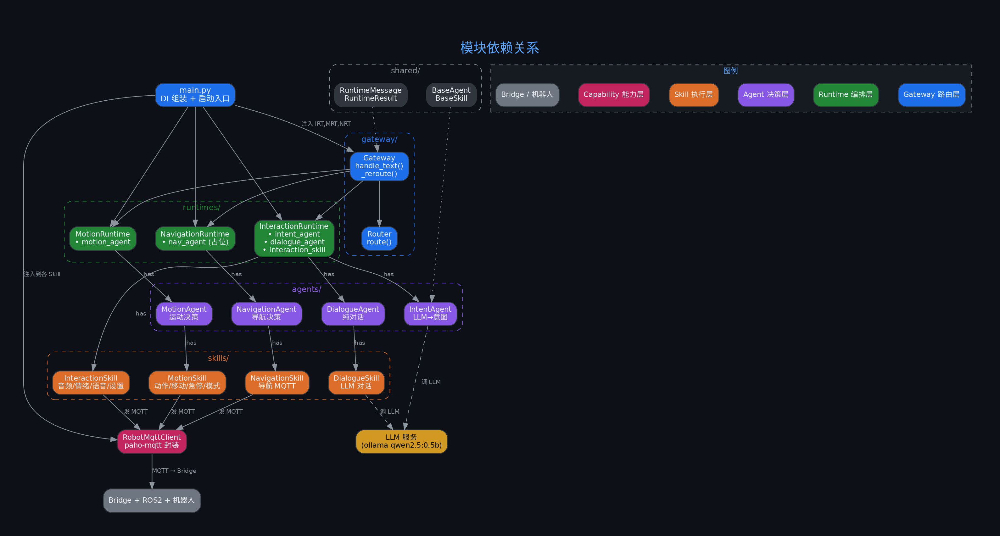
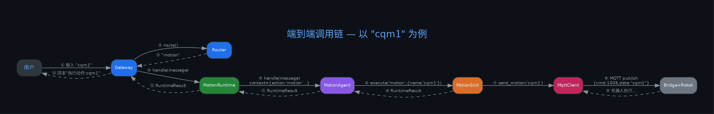
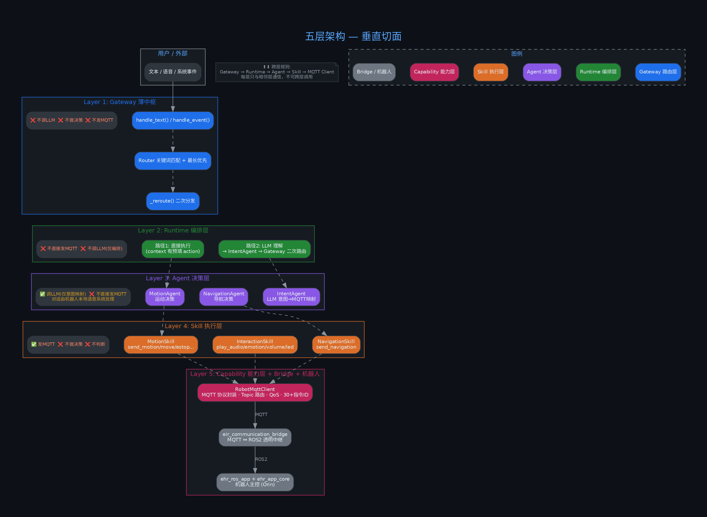
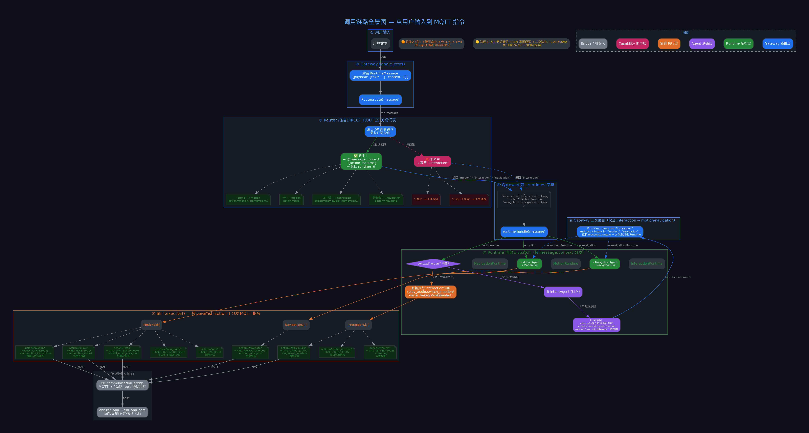

# Agent Runtime — 架构文档

## 文档索引

| 文档 | 说明 |
|------|------|
| [GAP_ANALYSIS.md](GAP_ANALYSIS.md) | Demo vs 设计文档逐模块差距分析 |
| [generate_diagrams.py](generate_diagrams.py) | 图表生成脚本 |

### 设计文档（来自 ehr_ros_app/design）

| 文档 | 说明 |
|------|------|
| [design/gateway_readme.md](design/gateway_readme.md) | Gateway 模块专项设计（13模块/路由/治理） |
| [design/file_framework.md](design/file_framework.md) | Agent Runtime 完整架构设计（14目录/Multi-Agent） |
| [design/IMPLEMENTATION_ROADMAP.md](design/IMPLEMENTATION_ROADMAP.md) | 实施路线图（4阶段/Bridge接口差距/架构问题） |

---

## 图表目录

### 1. 系统架构总览



完整的五层架构图：用户输入 → Gateway（10步治理链路）→ Runtime → Agent → Skill → MQTT Client → Bridge → 机器人。Gateway 已升级为包含 InputAdapter/Session/Priority/Safety/Router/Conflict/Trace 的完整治理中枢。

---

### 2. 请求处理流程



两种请求处理路径的对比：
- **路径 A（关键词命中）**：Router YAML匹配 → 直接执行 Skill，零 LLM 开销，< 1ms
- **路径 B（LLM理解）**：无关键词 → LLM 意图理解 → Gateway 二次路由 → 执行，~100-500ms

---

### 3. 路由决策树



从用户输入到 MQTT 指令的完整决策树。展示：
- Router YAML 关键词匹配 → 三种 Runtime 的分流
- 每个 Runtime 内部 Agent/Skill 的 dispatch 逻辑
- LLM 意图理解的 fallback 路径
- 所有 MQTT 指令 ID 的映射关系
- Gateway 治理模块介入点

---

### 4. 模块依赖关系



Python 代码层面的模块依赖图。展示 `main.py` 的依赖注入关系、Gateway 12 个模块的内部依赖、`shared/` 被所有模块引用、LLM 和 MQTT 的外部依赖边界。

---

### 5. 端到端时序图



以 `"cqm1"` 输入为例的完整时序图：用户 → Gateway（10步）→ Router → MotionRuntime → MotionAgent → MotionSkill → MqttClient → Bridge → 机器人 → 返回结果。

---

### 6. 五层架构垂直切面



五层架构的职责边界和通信规则：
- **Layer 1** Gateway 治理中枢：10步链路，路由+安全+优先级+Trace，不调 LLM
- **Layer 2** Runtime 编排：两条执行路径，不发 MQTT
- **Layer 3** Agent 决策：调 LLM，选意图，不发 MQTT
- **Layer 4** Skill 执行：发 MQTT 指令，不做决策
- **Layer 5** Capability + Bridge + 机器人

---

### 7. 调用链路全景图



一张图看懂从用户输入到 MQTT 指令的 **完整路由决策链**：

| 步骤 | 内容 | 关键代码 |
|------|------|---------|
| ① 用户输入 | 文本进入 Gateway | `gateway.py` |
| ② 输入适配 | InputAdapter 归一化为 RuntimeMessage | `input_adapter.py` |
| ③ Trace | 生成 trace_id，开始全链路记录 | `trace_logger.py` |
| ④ Session | 获取/创建会话上下文 | `session_router.py` |
| ⑤ 优先级 | 分配优先级 (emergency>high>normal>low) | `priority_manager.py` |
| ⑥ 安全 | SafetyGate 请求级过滤 | `safety_gate.py` |
| ⑦ Router | YAML 54条规则扫描，最长匹配 | `router.py` + `routes.yaml` |
| ⑧ 冲突 | 跨Runtime冲突检测 (preempt/queue/refuse) | `conflict_resolver.py` |
| ⑨ 分发 | RuntimeRouter 分发 + 二次路由 | `runtime_router.py` |
| ⑩ 执行 | Agent → Skill → MQTT → Bridge → ROS2 → 机器人 | 各层 |

**路径 A：** 关键词命中 → 免 LLM，< 1ms | **路径 B：** 无关键词 → LLM → 二次路由，~100-500ms

---

## 重新生成图表

```bash
cd agent_demo/docs
python3 generate_diagrams.py
```

依赖：
```bash
pip install graphviz          # Python 绑定
sudo apt install graphviz     # 系统 graphviz (dot 渲染引擎)
```
